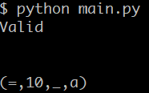
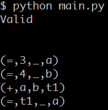
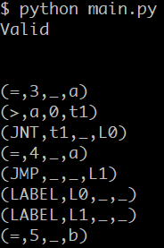
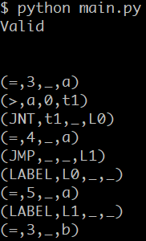
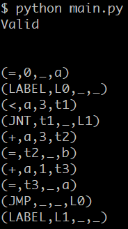
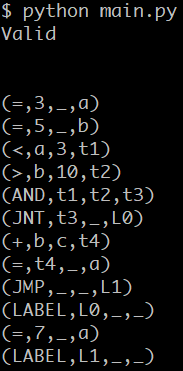
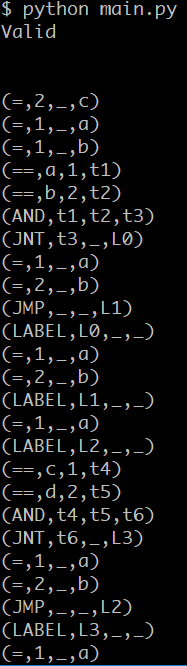

# Plycc

### 项目简介

* 在这个项目中，我使用了基于`Python`的`Lex-Yacc`库 [PLY](http://www.dabeaz.com/ply/ply.html)，并且全项目使用`Python`编写
* 此编译器可以生成包含短路条件的`if`结构对应四元式，`while`结构对应四元式
* 项目总行数约**700**，其中词法分析**100**行，语法分析**600**行
* 项目使用 Github 进行管理，仓库位于[Plycc](https://github.com/striderdu/Plycc)，上面有对应的 commit 记录和代码行数统计
* 用`Python`构建项目的原因有如下几点：
  * `Python`作为解释型语言，它要比`C`语言这种编译型语言，更加适合快速搭建原型（如我们的编译器）
  * `C`这类编译型语言适合写一些性能要求较高的程序
  * `Python`隐藏了一些底层的编程细节，我们可以更专注于实现功能，而不是调试用`C`可能会产生的各种语法错误

### 文法

```c
start_state -> INT ID OPBRAC CLOSEBRAC stmts
stmts -> OPENFLR stmts CLOSEFLR
       | if_stmt stmts
       | while_stmt stmts
       | expr_stmt STATETER stmts
       | declareint STATETER stmts
       | math stmts
       | newone stmts
       | ε
if_stmt -> X Y Z
X -> IF  OPBRAC cond_stmt  CLOSEBRAC
Y -> stmts
Z -> ELSE stmts
while_stmt -> XX YY
XX -> WHILE  OPBRAC whilecond_stmt  CLOSEBRAC
YY -> DO whilestmts
cond_stmt -> ID RELOP ID
           | ID RELOP NUMBER
           | NUMBER RELOP ID
           | NUMBER RELOP NUMBER
           | cond_stmt LOGOP cond_stmt
           | ε
whilecond_stmt -> ID RELOP ID
                | ID RELOP NUMBER
                | NUMBER RELOP ID
                | NUMBER RELOP NUMBER
                | whilecond_stmt LOGOP whilecond_stmt
                | ε
whilestmts -> OPENFLR whilestmts CLOSEFLR
            | iter_stmt
            | while_stmt
            | expr_stmt STATETER whilestmts
            | declareint STATETER whilestmts
            | math whilestmts
            | newone whilestmts
            | ε
expr_stmt -> assignment_int
           | declare
assignment_int -> INT ID ASSIGN NUMBER followint
                | INT ID  followint
followint -> COMMA ID ASSIGN NUMBER followint
           | COMMA ID  followint
           | ε
declare -> ID ASSIGN NUMBER followint
declareint -> ID ASSIGN NUMBER
newone -> ID ASSIGN ID PLUS NUMBER STATETER stmts
        | ID ASSIGN ID PLUS ID STATETER stmts
        | ID ASSIGN ID MINUS NUMBER STATETER stmts
        | ID ASSIGN ID MINUS ID STATETER stmts

math -> ID PLUS ASSIGN NUMBER STATETER
      | ID PLUS ASSIGN ID STATETER
      | ID MINUS ASSIGN NUMBER STATETER
      | ID MINUS ASSIGN ID STATETER
      | ID AOP ASSIGN NUMBER STATETER
      | ID AOP ASSIGN ID STATETER
      | PLUS PLUS ID STATETER
      | ID PLUS PLUS STATETER
      | MINUS MINUS ID STATETER
      | ID MINUS MINUS STATETER
```

### 生成四元式

#### if-else 结构

对于 if-else 结构的四元式生成，我采用如下的结构

```c
if(条件)
{
  语句1;
}
else
{
  语句2;
}

条件
(JNT,条件的真假,_,L0)
语句1
(JMP,_,_,L1)
(LABEL,L0,_,_)
语句2
(LABEL,L1,_,_)
```

我使用临时变量来存储条件的真假值，然后将临时变量入栈，目的是在跳转时对其进行使用，然后`pop()`出栈

当 Yacc 准备对`IF  OPBRAC cond_stmt  CLOSEBRAC`进行规约时，我生成了 JNT 要跳转到的 LABEL 号，然后`pop()`刚才的临时变量，将 LABEL 号入栈

之后开始对语句1进行规约，规约后要添加无条件跳转指令跳出 if，并设置语句2的入口为栈顶的 LABEL 号，之后`pop()`栈顶，并将跳出的 LABEL 号入栈

对`ELSE stmts`进行规约时，将出口设置为栈顶的 LABEL 号，并将其`pop()`，这样就完成了`if-else`结构的四元式生成

#### while结构

对于 while 结构的四元式生成，我采用如下的结构

```c
while(条件)do
{
  语句1;
}

(LABEL,L0,_,_)
条件
(JNT,条件的真假,_,L1)
语句1
(JMP,_,_,L0)
(LABEL,L1,_,_)
```

仿照着 if-else 结构，我设计了 while 结构的四元式

当对 while 执行的条件进行规约时，我首先设置一个入口标号，然后对条件判断其真假，用临时变量存储其值，依次入栈

当 Yacc 准备对`WHILE  OPBRAC whilecond_stmt  CLOSEBRAC`进行规约时，我生成了 JNT 要跳转到的 LABEL 号，然后`pop()`刚才的临时变量，将 LABEL 号入栈

然后这里我原本是想写`YY -> stmts`但是发现，有可能会规约到 if-else 结构中的 Y，然后我就在前面加了一个关键字 DO，这样在规约时，一定会规约到 YY 而不是Y

在规约`DO whilestmts`时，首先我要生成无条件跳转的四元式，使其跳回while的入口，之后再`pop()`栈顶的 LABEL，设置其为出口 LABEL

### 测试用例

```c
//test1.c
int main()
{
  int a;
  a=10;
}

//对应四元式
(=,10,_,a)
```


*****

```c
//test2.c
int main()
{
    int a;
    int b;
    a=3;
    b=4;
    a=a+b;
}

//对应四元式
(=,3,_,a)
(=,4,_,b)
(+,a,b,t1)
(=,t1,_,a)
```


*****

```c
//test3.c
int main()
{
    int a;
    int b;
    a=3;
    if(a>0)
    {
        a=4;
    }
    else{}
    b=5;
}

//对应四元式
(=,3,_,a)
(>,a,0,t1)
(JNT,t1,_,L0)
(=,4,_,a)
(JMP,_,_,L1)
(LABEL,L0,_,_)
(LABEL,L1,_,_)
(=,5,_,b)
```


*****

```c
//test4.c if-else
int main()
{
    int a;
    int b;
    a=3;
    if(a>0)
    {
        a=4;
    }
    else
    {
        a=5;
    }
    b=3;
}

//对应四元式
(=,3,_,a)
(>,a,0,t1)
(JNT,t1,_,L0)
(=,4,_,a)
(JMP,_,_,L1)
(LABEL,L0,_,_)
(=,5,_,a)
(LABEL,L1,_,_)
(=,3,_,b)
```


*****

```c
//test5.c while
int main()
{
    int a;
    int b;
    a=0;
    while(a<3)do
    {
        a=a+1;
        b=a+3;
    }
}

//对应四元式
(=,0,_,a)
(LABEL,L0,_,_)
(<,a,3,t1)
(JNT,t1,_,L1)
(+,a,3,t2)
(=,t2,_,b)
(+,a,1,t3)
(=,t3,_,a)
(JMP,_,_,L0)
(LABEL,L1,_,_)
```


*****

```c
//test7.c 带短路
int main()
{
    int a;
    int b;
    int c;
    a=3;
    b=5;
    if(a<3 && b>10)
    {
        a=b+c;
    }
    else
    {
        a=7;
    }
}

对应四元式
(=,3,_,a)
(=,5,_,b)
(<,a,3,t1)
(>,b,10,t2)
(AND,t1,t2,t3)
(JNT,t3,_,L0)
(+,b,c,t4)
(=,t4,_,a)
(JMP,_,_,L1)
(LABEL,L0,_,_)
(=,7,_,a)
(LABEL,L1,_,_)
```


*****

```c
//test.c if-else + while
int main()
{
    int a=1, c=2;
    int b=1;
    if(a==1&&b==2)
    {
        a=1;
        b=2;
    }
    else
    {
        a=1;
        b=2;
    }
    a=1;
    while(c==1&&d==2)do
    {
        a=1;
        b=2;
    }
    a=1;
}

对应四元式
(=,2,_,c)
(=,1,_,a)
(=,1,_,b)
(==,a,1,t1)
(==,b,2,t2)
(AND,t1,t2,t3)
(JNT,t3,_,L0)
(=,1,_,a)
(=,2,_,b)
(JMP,_,_,L1)
(LABEL,L0,_,_)
(=,1,_,a)
(=,2,_,b)
(LABEL,L1,_,_)
(=,1,_,a)
(LABEL,L2,_,_)
(==,c,1,t4)
(==,d,2,t5)
(AND,t4,t5,t6)
(JNT,t6,_,L3)
(=,1,_,a)
(=,2,_,b)
(JMP,_,_,L2)
(LABEL,L3,_,_)
(=,1,_,a)
```

